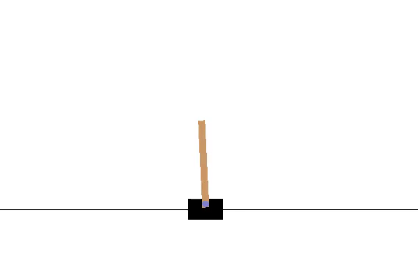
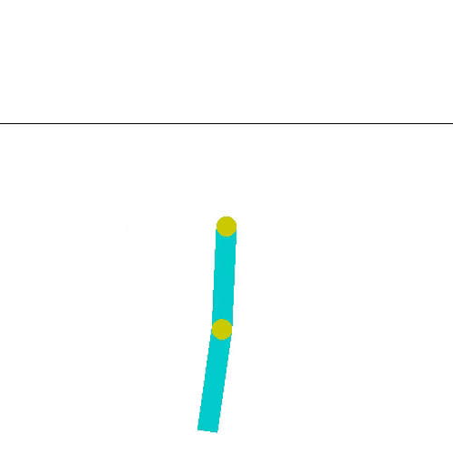
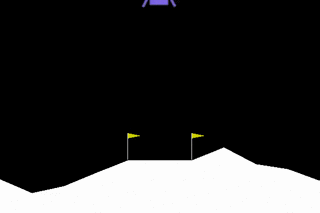

# GymmeForce  
*Work in progress...*  
## Installation
```bash
git clone https://github.com/lgvaz/gymmeforce  
cd gymmeforce  
pip install -e .  
```
## About  
[TensorFlow](https://www.tensorflow.org/) implementation of [DQN](https://www.nature.com/nature/journal/v518/n7540/full/nature14236.html?foxtrotcallback=true) for solving [OpenAi-Gym](https://gym.openai.com/) discrete environments.  


  


  
**Standard DQN run on Breakout**  
Mean reward after training: 421 (100 episodes)  
Dark blue: Standard DQN  
Light blue: Double DQN  
  

