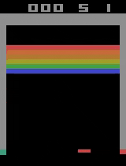
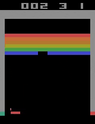
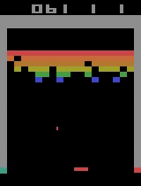
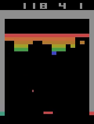
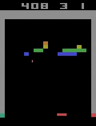
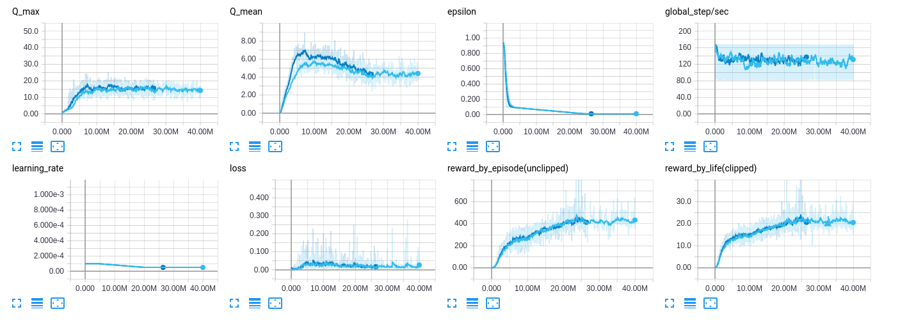
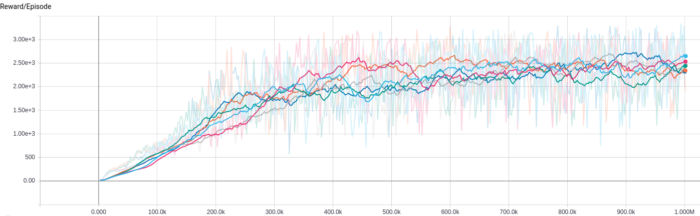

# Reinforcement Learning Box
*Work in progress...*  
RLBox provides a framework for rapid experimentation with popular Deep Reinforcement Learning algorithms, it focus on making very easy to implement new ideias, which can be rapidly evaluated using [OpenAI Gym](https://github.com/openai/gym).  

## Installation
```bash
git clone https://github.com/apparatusbox/rlbox.git
cd rlbox  
pip install -e .  
```

## How to use  
Examples on how to run different agents can be found on the [examples](https://github.com/lgvaz/rlbox/tree/master/examples) folder.  

## Implemented algorithms  
### State of the art
* [DQN](https://storage.googleapis.com/deepmind-media/dqn/DQNNaturePaper.pdf) and extensions
  * [Double Q-learning](https://arxiv.org/pdf/1509.06461.pdf)  
  * [Dueling networks](https://arxiv.org/pdf/1511.06581.pdf)
  * N-step learning
  * Soft target update
* [PPO](https://arxiv.org/pdf/1707.06347.pdf)
  * Clipped Surrogate Objective  
  * Adaptive KL Penalty Coefficient  
  
### Classical
* Vanilla Policy Gradient
* REINFORCE
* Actor-Critic

## Results  
* __DQN on BreakoutNoFrameskip-v4__  
Episode 0 ---------------- Episode 3500 ----------- Episode 6000 ----------- Episode 7500 ----------- Episode 21500  




   
Mean reward after training: 421 (Averaged over 100 episodes)  
Dark blue: Standard DQN  
Light blue: Double DQN  
  

* __PPO on Hopper-v1__ [Video](https://www.youtube.com/watch?v=QHAu8EWRJJ0&feature=youtu.be)  
  
