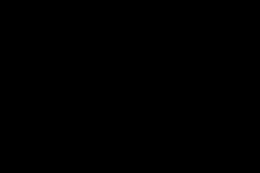
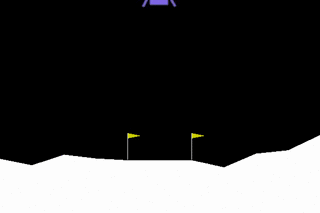
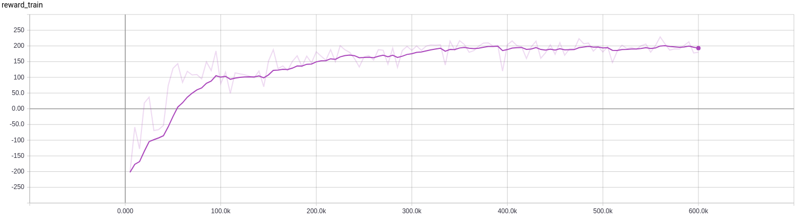

# Deep Q-Learning
*Work in progress*  
## About  
Implementation of [DQN](https://www.nature.com/nature/journal/v518/n7540/full/nature14236.html?foxtrotcallback=true) for solving [OpenAi-Gym](https://gym.openai.com/) discrete environments.  

  
  

